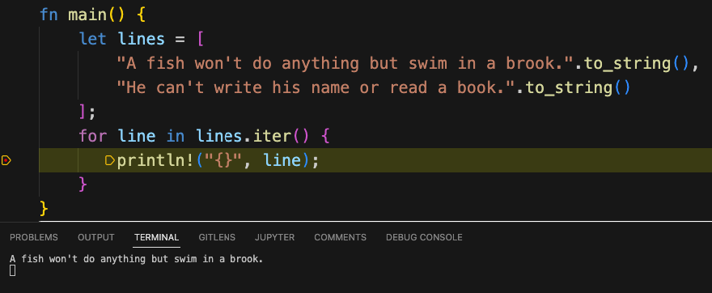

# Debugging Multiple Rust Applications in VS Code

Working on this blog in mdbook, I soon learned that it was possible to write individual "application files" and include them in markdown using a syntax that looked like this:

<pre>
```rust
{{ #include &lt;filename&gt; }}
```
</pre>

This made them runnable in the browser by sending the code out to Rust Playground to be compiled and run.  However, often when developing these, "snippet-length" application files, we want to run the program in the debugger.

At first this didn't seem possible, since the VS code debugger seemed to want to work with a Cargo configuration, and for all I knew when I began my research, Cargo could only build a single application or library at a time.  After digging into it for a little bit, however, it turned out that solving this puzzle was not only possible, but fairly easy.

## Debugging Rust in VS Code -- First Steps

Before we describe how to set up Rust for debugging multiple small applications, we need to back up and make sure we have the pre-requisites to debug _anything_ in Rust.  To debug Rust, we first need to install two VS Code extensions:

* [Rust-Analyzer](https://marketplace.visualstudio.com/items?itemName=rust-lang.rust-analyzer) provides language support (code completion, navigation, etc). for Rust.  
* [CodeLLDB](https://marketplace.visualstudio.com/items?itemName=vadimcn.vscode-lldb) is an extension that uses LLDB to debug Rust, C++, and other compiled languages.

The next step after installing these extensions is to make sure you can set breakpoints in your source.  To do this, go into VS Code settings and search for the word "Everywhere" to bring up the setting "Allow Breakpoints Everywhere" and make sure that this option is checked.

## Cargo Options and launch.json

For debugging anything in Rust using VS Code, one essential resource is the [Cargo Targets](https://doc.rust-lang.org/cargo/reference/cargo-targets.html) page of the Cargo Book. It turns out that there are a few more target types than simple binary targets (applications, defined in src/main.rs) and library targets (defined in src/lib.rs).  

For example, it's possible to declare additional binary targets, with the source going in src/bin/target_name.rs, but each one of these requires a separate section in cargo.toml, plus a way to tell the debugger (via launch.json) which of these we want to run. That solution would work, but it would be much more high maintenance than we wanted.

Fortunately, the next piece of Cargo-ie goodness that we bumped into turned out to be just the thing we needed for our RustAssured snippets.  This was the [examples directory](https://doc.rust-lang.org/cargo/reference/cargo-targets.html#examples).  It turned out we could add any rust "executable" src file (i.e., a file with a main method) to that directory, and as long as we had a minimal cargo.toml in the root, we could run the file &lt;root&gt;/examples/expressions.rs (for example) with the cargo command ```cargo run --example expressions```.

Here's all we need for our minimal cargo.toml file, which we placed in the root of the repository:

```toml
[package]
name = "unused"
version = "0.1.0"
```

Now hang in there with me -- I know this is a lot of explanation, but believe it or not, we're almost done!  We have our extensions installed, our breakpoint setting set, and our stub cargo.toml file. 

The only thing left to do is to add (or edit) the file .vscode/launch.json to contain this configuration:

```json
{
    "configurations": [
        {
            "type": "lldb",
            "request": "launch",
            "name": "Debug current examples file",
            "cargo": {
                "args": [
                    "run",
                    "--example",
                    "${fileBasenameNoExtension}"                    
                ]
            },
            "args": []
        }  
    ]
}
```
It's possible to modify this to include whatever name you want and run any cargo command, for example, to run tests.  As written, it debugs the current file in the examples directory, so I can set a breakpoint to run these two lines of [Swinging on a Star](https://www.youtube.com/watch?v=gRazSO9xjFo), by Bing Crosby, one line at a time.



And of course, now that I know that Bing Crosby's two lines about a fish work OK, what kind of a bad person would I be if I didn't let you run them in the browser, too?

Just click on the code below to see the run button:

```rust
{{ #include ../examples/fish.rs }}
```
